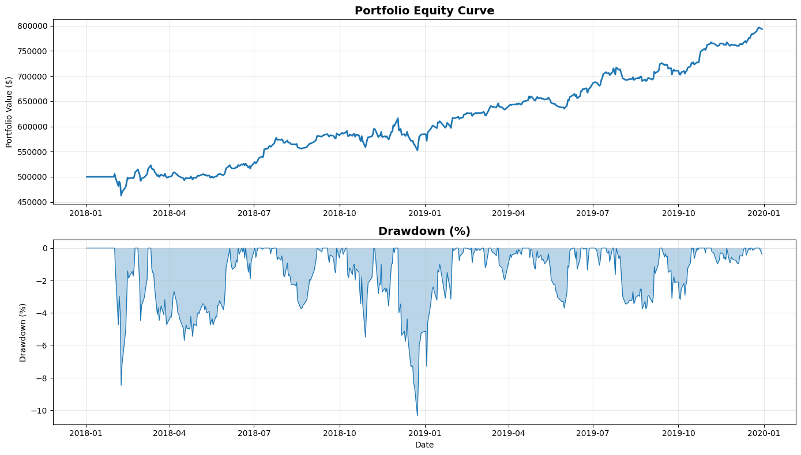
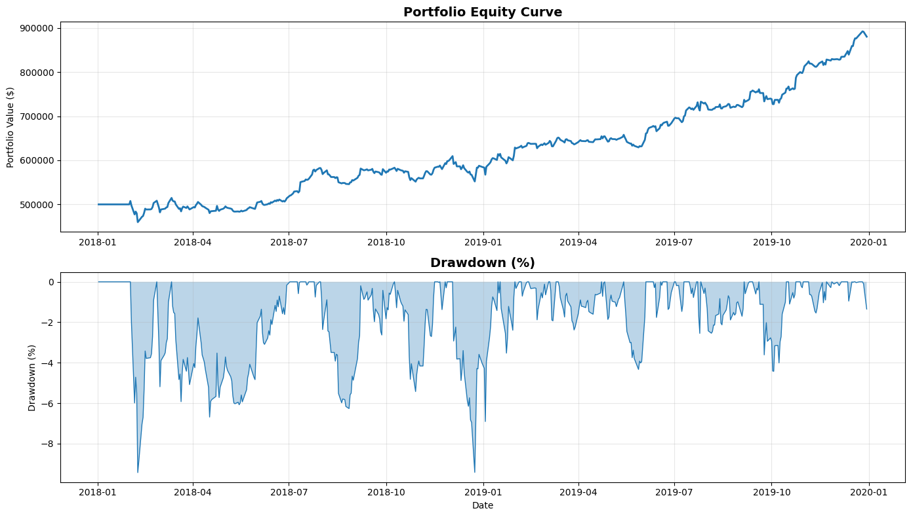

# robust-macd-mad--alpha

Event-driven backtesting framework for a hybrid momentum + mean-reversion
strategy with robust MAD scaling and ATR-based risk management. Includes a
multi-asset portfolio layer with periodic rebalancing and an optional MPT
tangent (max-Sharpe) optimizer.

Module: IS4226 Systematic Trading Strategies & Systems

## Strategy Summary
This system trades on daily bars:
- Signal computed at Close
- Order executed at next day Open (avoid lookahead)
- 150-day warmup for indicator stability

Four complementary legs under one state machine:
- LM (Long Momentum): trend-following in bullish context
- SM (Short Momentum): trend-following in bearish context
- LR (Long Reversion): buy oversold extremes
- SR (Short Reversion): sell overbought extremes

Core idea:
Use MACD histogram to detect momentum vs overextension, scale thresholds by
robust volatility (MAD), confirm context with log-price Bollinger Bands, and
manage exits with ATR-scaled TP/SL.

## Signal Construction
### MACD Histogram (Momentum Core)
Let h_t be the MACD histogram at time t over window W:
- med_t = median(h over last W)
- MAD_t = median(|h - med_t|)
- RS_t = 1.4826 * MAD_t

Dynamic thresholds:
- Zpos_t = +k * RS_t
- Zmid_t =  k_mid * RS_t
- Zneg_t = -k * RS_t

Interpretation:
- Near zero momentum: -Zmid_t <= h_t <= +Zmid_t -> momentum entries
- Extreme momentum: h_t > Zpos_t or h_t < Zneg_t -> mean-reversion entries

### Bollinger Bands on Log-Price (Context Filter)
Bollinger Bands are computed on ln(Close) for scale invariance:
- Close > Upper -> overbought context
- Close < Lower -> oversold context
- Close vs Middle -> bullish/bearish trend filter

## Trading Rules (Entry/Exit)
### Entry Logic (evaluated at Close)
- SR: h > Zpos AND Close > upper_band
- LR: h < Zneg AND Close < lower_band
- LM: 0 <= h <= Zmid AND Close > middle_band
- SM: -Zmid <= h <= 0 AND Close < middle_band

### Execution
- Enter at next day Open after a signal at Close

### Risk Management / Exits
At entry price px:
- Long: TP = px + ATR * tp_mult, SL = px - ATR * sl_mult
- Short: TP = px - ATR * tp_mult, SL = px + ATR * sl_mult
- Optional trailing logic via trail_mult
- Time-stop closes trades beyond max holding period

### State Guards (Anti-Churn)
- Cooldown after exit
- Rebound/flip guard to reduce whipsaws
- Limit consecutive LM/SM stacking

## Portfolio Layer
### Universe
Backtests were run on:
AAPL, AMZN, META, GOOG, GOOGL, NVDA, MSFT, AVGO, TSLA, BRK-B

### Periodic Rebalancing (Capital Reset)
- Rebalance every 120 trading days
- Close all positions -> recompute signals -> re-allocate -> re-enter

### Optional Modern Portfolio Optimizer (MPT / Tangent Portfolio)
Max-Sharpe optimizer with:
- Ledoit-Wolf shrinkage covariance
- Ridge regularization
- Exponentially-weighted mean returns
- Analytical efficient frontier with long-only constraint

### How the Portfolio Is Selected
1) Apply an equal-weighted portfolio across all candidate stocks.
2) Run the strategy on a prior training window.
3) Rank stocks by strategy performance in that window.
4) Select the strongest performers and assign final weights
   (equal-weight or optimized weights if MPT is enabled).

## Results Snapshot (2018-2019 Test)
- Before optimization: ~26.09% annualized, Sharpe ~1.81
- After optimization: ~32.87% annualized, Sharpe ~1.93, Max DD ~-9.43%
- SPY buy & hold shows larger drawdown (~-19.34%)

Results (before optimization):

Results (after portfolio optimization):

SPY buy & hold:

### Metrics Table (Before vs After vs SPY)
All results use initial capital $500,000.

| Metric | Before Opt | After Opt | SPY B&H |
| --- | --- | --- | --- |
| Final Portfolio Value | 793,144.00 | 880,327.12 | 622,283.68 |
| Total Return | 58.63% | 76.07% | 24.03% |
| CAGR | 26.09% | 32.87% | 11.62% |
| Annualized Volatility | 13.32% | 15.29% | 14.96% |
| Sharpe Ratio | 1.81 | 1.93 | 0.80 |
| Max Drawdown | -10.34% | -9.43% | -19.34% |
| Calmar Ratio | 5.67 | 8.06 | 1.24 |
| Beta vs Benchmark | 0.5750 | 0.5043 | - |
| Alpha (annual, %) | 17.19 | 23.56 | - |
| Sortino Ratio | 2.33 | 2.73 | 0.96 |
| Omega Ratio | 1.40 | 1.43 | 1.16 |
| Ulcer Index | 2.44 | 2.71 | 4.99 |
| UPI (UP Ratio) | 0.60 | 0.64 | 0.51 |
| Skewness | -0.1736 | 0.2323 | -0.5263 |
| Kurtosis | 6.0024 | 4.2945 | 3.8150 |
| VaR 95% (% loss) | 1.13 | 1.43 | 1.76 |
| CVaR 95% (% loss) | 1.90 | 2.04 | 2.47 |
| Total Trades | 484 | 278 | 1 |

## Reproducibility / How to Run
### Notebook Entry Point
- `Group6_FinalTerm.ipynb`

### Recommended Workflow (Train -> Test)
Step 1 — Train (stock selection & allocation):
1) Choose a training window immediately before test period
2) Run strategy on training with best_params
3) Outputs: selectedTicker1, allocationPortfolio1

Step 2 — Test:
1) Set test years
2) Backtest reuses selectedTicker1 + allocationPortfolio1

Step 3 — Visualize:
Use dashboard plots for equity curve, drawdowns, rolling metrics, and SPY
comparison.

## Parameters
The tuned best_params include:
- MACD fast/slow/signal
- MAD window + thresholds (k, k_mid)
- Bollinger window + std
- ATR window
- TP/SL multipliers per leg
- Trailing options
- Time stop / cooldown / rebounce block
- Rebalance frequency (120)

## Design Notes
- MAD-scaled MACD thresholds improve robustness under outliers
- Log-price Bollinger Bands enforce scale invariance
- ATR-based exits normalize risk per trade
- State guards + cooldown reduce whipsaw

## Limitations & Next Improvements
Limitations:
- Regime dependence with fixed parameters
- No explicit regime classifier
- Transaction costs set to 0 in the project

Planned upgrades:
- Multi-segment stability testing
- Adaptive rebalancing & selection
- Regime-aware filtering (HMM / change-point)
- Transaction cost + slippage integration

## Disclaimer
Educational/research use only. Not financial advice.

## Repository Contents
- `Group6_FinalTerm.ipynb` — main notebook with strategy design, optimizer, and backtest
- `result.png` — baseline results (pre-optimization)
- `result_using_portfolio.png` — results using optimized portfolio
